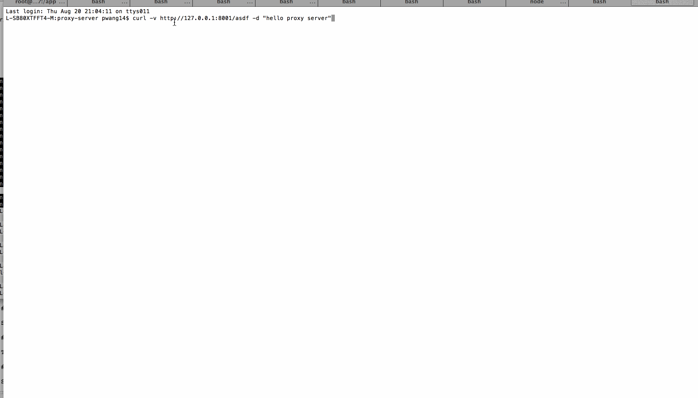

# Proxy Server

This is a Proxy Server for Node.js submitted as the [pre-work](http://courses.codepath.com/snippets/intro_to_nodejs/prework) requirement for CodePath.

Time spent: 4 ~ 5 hrs

Completed:

* [] Required: Requests to port `8000` are echoed back with the same HTTP headers and body
* [] Required: Requests/reponses are proxied to/from the destination server
* [] Required: The destination server is configurable via the `--host`, `--port`  or `--url` arguments
* [] Required: The destination server is configurable via the `x-destination-url` header
* [] Required: Client requests and respones are printed to stdout
* [] Required: The `--logfile` argument outputs all logs to the file specified instead of stdout

Walkthrough Gif:



Note: to embed the gif file, just check your gif file into your repo and update the name of the file above.

## Starting the Server

```bash
npm start
```

## Features

### Echo Server:

Last login: Thu Aug 20 21:04:11 on ttys011
L-SB80XTFFT4-M:proxy-server pwang14$ curl -v -X POST http://127.0.0.1:8000 -d "hello echo sever" -H "x-echo-server: abc"
* About to connect() to 127.0.0.1 port 8000 (#0)
*   Trying 127.0.0.1...
* Adding handle: conn: 0x7fbe7a004400
* Adding handle: send: 0
* Adding handle: recv: 0
* Curl_addHandleToPipeline: length: 1
* - Conn 0 (0x7fbe7a004400) send_pipe: 1, recv_pipe: 0
* Connected to 127.0.0.1 (127.0.0.1) port 8000 (#0)
> POST / HTTP/1.1
> User-Agent: curl/7.30.0
> Host: 127.0.0.1:8000
> Accept: */*
> x-echo-server: abc
> Content-Length: 16
> Content-Type: application/x-www-form-urlencoded
>
* upload completely sent off: 16 out of 16 bytes
< HTTP/1.1 200 OK
< user-agent: curl/7.30.0
< host: 127.0.0.1:8000
< accept: */*
< x-echo-server: abc
< content-length: 16
< content-type: application/x-www-form-urlencoded
< Date: Fri, 21 Aug 2015 04:07:02 GMT
< Connection: keep-alive
<
* Connection #0 to host 127.0.0.1 left intact
hello echo sever

### Proxy Server:

Port 8001 will proxy to the echo server on port 8000.

L-SB80XTFFT4-M:proxy-server pwang14$
L-SB80XTFFT4-M:proxy-server pwang14$
L-SB80XTFFT4-M:proxy-server pwang14$ curl -v http://127.0.0.1:8001/asdf -d "hello proxy server"
* About to connect() to 127.0.0.1 port 8001 (#0)
*   Trying 127.0.0.1...
* Adding handle: conn: 0x7fde63804400
* Adding handle: send: 0
* Adding handle: recv: 0
* Curl_addHandleToPipeline: length: 1
* - Conn 0 (0x7fde63804400) send_pipe: 1, recv_pipe: 0
* Connected to 127.0.0.1 (127.0.0.1) port 8001 (#0)
> POST /asdf HTTP/1.1
> User-Agent: curl/7.30.0
> Host: 127.0.0.1:8001
> Accept: */*
> Content-Length: 18
> Content-Type: application/x-www-form-urlencoded
>
* upload completely sent off: 18 out of 18 bytes
< HTTP/1.1 200 OK
< user-agent: curl/7.30.0
< host: 127.0.0.1:8001
< accept: */*
< content-length: 18
< content-type: application/x-www-form-urlencoded
< connection: keep-alive
< date: Fri, 21 Aug 2015 04:07:11 GMT
<
* Connection #0 to host 127.0.0.1 left intact
hello proxy server

### Configuration:

#### CLI Arguments:

The following CLI arguments are supported:

##### `--host`

The host of the destination server. Defaults to `127.0.0.1`.

##### `--port`

The port of the destination server. Defaults to `80` or `8000` when a host is not specified.

##### `--url`

A single url that overrides the above. E.g., `http://www.google.com`

##### `--logfile`

Specify a file path to redirect logging to.

#### Headers

The follow http header(s) are supported:

##### `x-destination-url`

Specify the destination url on a per request basis. Overrides and follows the same format as the `--url` argument.
